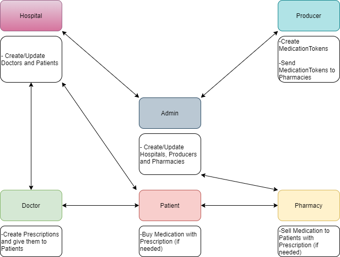

# UM - Blockchain 2020

Proyecto para la trazabilidad de medicamentos y recetas médicas.

## Diagrama

## Roles

Hay distintos roles, cada uno con distintas funciones y derechos.

- Administradores
- Hospitales
- Fabricantes de medicamentos
- Farmacias
- Doctores
- Pacientes

## Comandos para comenzar

> Estando en modo desarrollador

    migrate --reset
    let c = {};
    SupplyChain.deployed().then((_c) => c = _c);

Ahora la variable "c" sirve para llamar a los metodos del contrato.

Los valores de las address se acceden desde Ganache

## Funciones de roles

#### Administrador:

Agregar:

    c.addAdmin(address_usuario)

Verificar (devuelve true o false):
    
    c.isAdmin(address_usuario)

#### Farmacia:

Agregar:

    c.addPharmacy(address_usuario)

Verificar (devuelve true o false):
    
    c.isPharmacy(address_usuario)
    
#### Doctor:

Agregar:
    
    c.addDoctor(address_usuario)
    
Verificar (devuelve true o false):
    
    c.isDoctor(address_usuario)
    
#### Hospital:

Agregar:
    
    c.addHospital(address_usuario)
    
Verificar (devuelve true o false):
    
    c.isHospital(address_usuario)
    
#### Productor (fabricante de medicamentos):

Agregar:
    
    c.addProducer(address_usuario)
    
Verificar (devuelve true o false):
    
    c.isProducer(address_usuario)
    
Transferir a tienda:

    c.transferTkToStore(id_medicamento)
    
#### Paciente:

Agregar:
    
    c.addPatient(address)
    
Verificar (devuelve true o false):
    
    c.isPatient(address)
    
#### Receta:

Agregar:
    
    c.addPrescription(address)
    
Retirar medicamento:
    
    c.usePrescription(address_cliente, id_medicamento)
    
Crear medicamento nuevo (requiere_receta es un bool):

    c.mintMTk(id_medicamento, nombre_medicamento, requiere_receta)